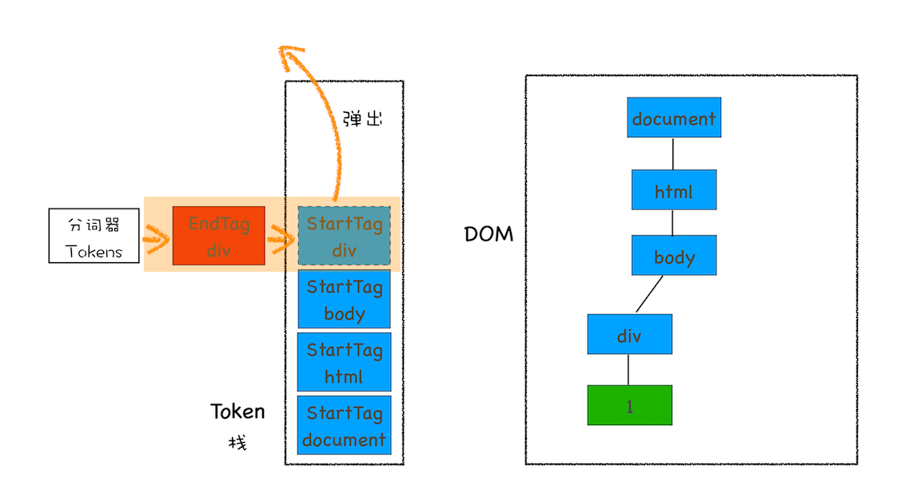

# HTML 解析过程

[toc]

## 前言

HTML 解析一般是指 html 文件字节流生成 DOM 结构的过程。在渲染引擎内部，有一个 HTML 解析器模块专门负责将 HTML 字节流转换为 DOM 结构。HTML 解析器并不是等整个文档加载完成之后再解析的，而是**网络进程加载了多少数据，HTML 解析器便解析多少数据**

## 字节流转换为 DOM

### 1. 分词器生成 token

首先分词器先将字节流转换为一个个 Token，分为 Tag Token 和文本 Token

### 2. token 解析为 DOM 节点

生成 token，会维护一个栈结构来保存这些 token。这个过程和判断嵌套括号是否合法的算法是一样的

## JS 如何影响 DOM 渲染

当解析到`<script>`标签时，渲染引擎判断这是一段脚本，此时 HTML 解析器就会暂停 DOM 的解析，因为接下来的 JavaScript 可能要修改当前已经生成的 DOM 结构。这时候 HTML 解析器暂停工作，JavaScript 引擎介入，并执行 script 标签中的这段脚本。脚本执行完成之后，HTML 解析器恢复解析过程，继续解析后续的内容，直至生成最终的 DOM。如果 `<script>` 脚本是通过文件下载的，那么还要等待网络下载的过程。

### 预解析

不过 Chrome 浏览器做了很多优化，其中一个主要的优化是**预解析操作**。当渲染引擎收到字节流之后，会开启一个预解析线程，用来分析 HTML 文件中包含的 JavaScript、CSS 等相关文件，解析到相关文件之后，预解析线程会提前下载这些文件。

### 异步加载

如果 JavaScript 文件中没有操作 DOM 相关代码，就可以将该 JavaScript 脚本设置为异步加载，通过 async 或 defer 来标记代码。使用 async 标志的脚本文件一旦加载完成，会立即执行；而使用了 defer 标记的脚本文件会在文档完成解析后， DOMContentLoaded 事件之前执行。

## CSS 如何影响 DOM 渲染

和 HTML 一样，渲染引擎也是无法直接理解 CSS 文件内容的，所以需要将其解析成渲染引擎能够理解的结构，这个结构就是 CSSOM。布局树需要 DOM 和 CSSOM 才能生成。正常情况下，CSS 文件的加载不会阻塞 DOM 的解析，但有个别的例外。

在执行 JavaScript 脚本之前，如果页面中包含了外部 CSS 文件的引用，或者通过 style 标签内置了 CSS 内容，那么渲染引擎还需要将这些内容转换为 CSSOM，因为 JavaScript 有修改 CSSOM 的能力，所以在执行 JavaScript 之前，还需要依赖 CSSOM。也就是说 CSS 在部分情况下也会阻塞 DOM 的生成。

