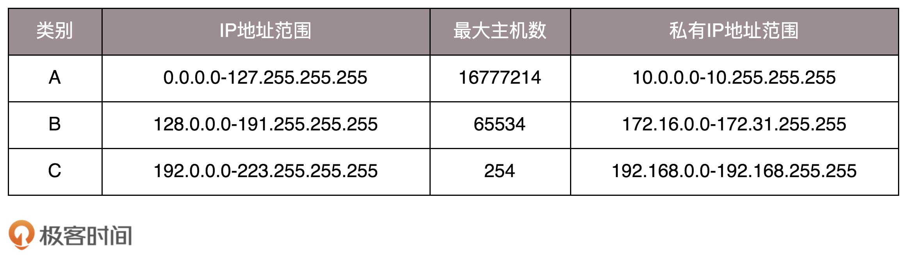

IP 是一个网卡在网络世界的通讯地址，我们目前主要学习 IPV4:

私有 IP 对照表：

## 无类型域间选路 (CIDR)

可以通过子网掩码将 IP 地址一分为二，比如 `10.100.122.2/24` 表示其前24位是网络号，后8位是主机号，那么其对应的子网掩码为： `255.255.255.0`，广播地址为 `10.100.122.255`

**将子网掩码和 IP 地址按位计算就可得到网络号**。

一般 `192.168.0.1` 表示私有网络的出口地址，家里的 WIFI 路由器一般都是这个地址，`192.168.0.255` 是广播地址

## MAC 地址

MAC 地址是一个网卡的物理地址，全局唯一，是一个类似于身份证的唯一标识。MAC 地址一般会用来在同一个网段中进行通信。比如 ARP 请求 (用来获取同一网段中目标主机的 MAC 地址)。给同一网段中的主机发送一个包光知道 IP 地址是不够的，还需要知道 MAC 地址。

## 动态主机配置协议 (DHCP)

刚加入某个网段的主机可以通过 DHCP 协议来自动配置 IP。

1. 新加入的主机使用 `0.0.0.0` IP 发送一个广播包，目的 IP 为 `255.255.255.255`，这个包里有请求分配 IP 的信息
2. DHCP Server 接收到这个请求后，以同样的方式发送一个广播包，里面包含了自己的 MAC 地址，可分配的 IP，子网掩码，网关，IP 地址租用期等信息
3. 当收到这个广播包后（收到多个时，会选择先到的那个），会再次发次一个广播包表示接受这个 IP 地址，包里有自己的 IP, MAC 地址等
4. DHCP Server 接收到这个包后，返回一个 DHCP ACK 消息包，整个流程结束